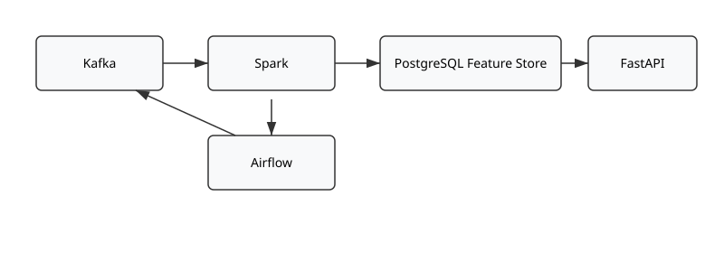

# Olist ML Feature Pipeline


## Overview

Olist ML Feature Pipeline is a batch-processing data engineering project that builds a reliable, scalable, and maintainable backend for machine learning feature generation. The platform uses the Olist Brazilian E-Commerce dataset and transforms raw transactional data into ML-ready feature tables through a reproducible microservices architecture.

The project follows Infrastructure as Code (IaC) principles and uses Docker Compose to deploy isolated services for ingestion, storage, processing, orchestration, and delivery.

---

## Project Goals

- Build a reproducible batch-processing data platform
- Implement a microservices-based architecture
- Perform large-scale feature engineering using Apache Spark
- Orchestrate workflows with Apache Airflow
- Store processed feature tables in PostgreSQL
- Deliver feature data through a FastAPI service
- Apply reliability, scalability, and maintainability principles

---

## Technology Stack

| Component | Technology | Purpose |
|------------|------------|------------|
| Data Ingestion | Apache Kafka | Scheduled data ingestion |
| Raw Data Storage | HDFS | Distributed storage layer |
| Processing Engine | Apache Spark | Feature engineering and aggregation |
| Workflow Orchestration | Apache Airflow | Pipeline scheduling and management |
| Feature Store | PostgreSQL | Storage of processed features |
| API Layer | FastAPI | Feature delivery service |
| Containerization | Docker Compose | Infrastructure as Code |
| Version Control | Git & GitHub | Source control and collaboration |

---

## Architecture



The architecture follows a Lambda-inspired batch-processing pattern. E-commerce transaction data is ingested through Kafka, stored in HDFS, transformed using Apache Spark, loaded into PostgreSQL feature tables, and finally exposed through a FastAPI service for downstream machine learning applications.

---

## Repository Structure

```text
olist-ml-feature-pipeline/
│
├── airflow/
│   └── dags/
│
├── producer/
│
├── spark/
│
├── postgres/
│
├── api/
│
├── datasets/
│
├── docs/
│
├── docker-compose.yml
├── requirements.txt
└── README.md
```

### Folder Description

| Folder | Description |
|----------|----------|
| airflow | Airflow DAGs and scheduling logic |
| producer | Kafka ingestion scripts |
| spark | Batch processing and feature engineering jobs |
| postgres | Database initialization scripts |
| api | FastAPI application |
| datasets | Olist dataset files |
| docs | Architecture diagrams and project screenshots |

---

## Dataset

**Dataset:** Olist Brazilian E-Commerce Dataset

**Source:**  
https://www.kaggle.com/datasets/olistbr/brazilian-ecommerce

The dataset contains more than one million timestamped e-commerce records and serves as the source for feature engineering and sales forecasting use cases.

---

## Current Project Status

### Completed
- Architecture design
- Technology selection
- Infrastructure planning
- Dataset selection
- Phase 1 (Conception Phase)

### In Progress
- Docker environment setup
- Kafka implementation
- Spark batch processing jobs
- Airflow orchestration
- PostgreSQL feature store
- FastAPI service

---

## Local Development

```bash
git clone https://github.com/iamshahid555/olist-ml-feature-pipeline.git
cd olist-ml-feature-pipeline
```

Implementation is currently under active development.

---

## Academic Context

**Course:** DLMDSEDE02 – Data Engineering Portfolio Project  
**Institution:** IU International University of Applied Sciences

### Focus Areas

- Batch Processing
- Data Engineering
- Microservices
- Infrastructure as Code
- Feature Engineering
- Machine Learning Pipelines

---

## License

MIT License